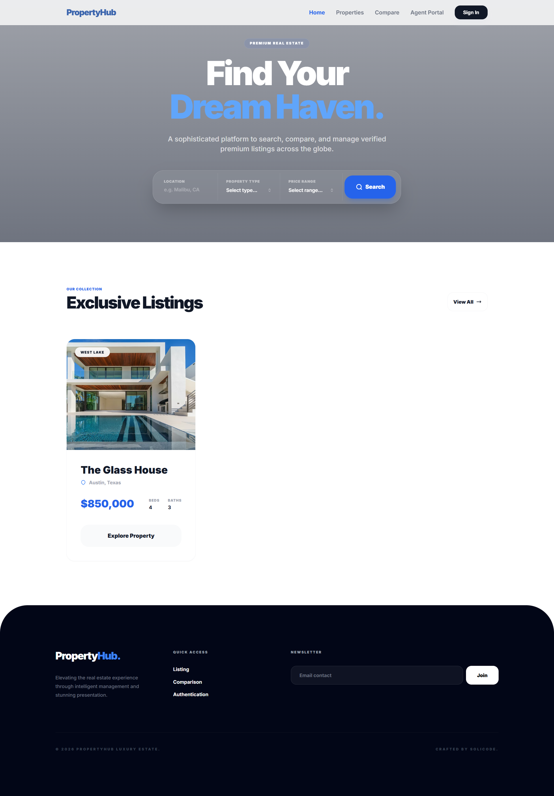
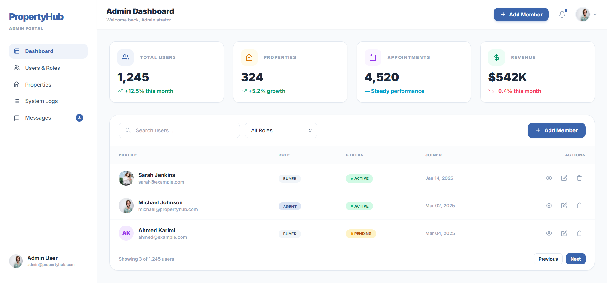
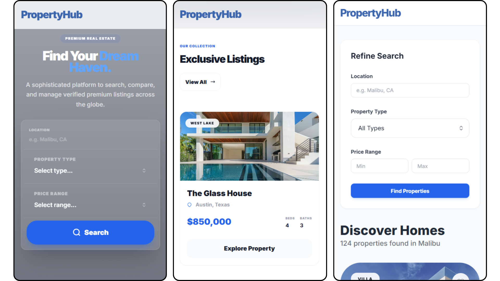

  
  

# Final Year Project
### PropertyHub - Integrated Real Estate Management System

**Created by:** AZIZ Soufiane  
**Supervised by:** M. ESSARRAJ Fouad  
**Program:** Web and Mobile Development

---

## Table of Contents

  

1

Project Context

  

2

Methodology

  

3

Functional Branch

  

4

Technical Branch

  

5

Design

  

6

Conclusion

---

## 1. Project Context

  

---

## 2. Methodology: Design Thinking

  

---

## 2. Methodology: Scrum (Agile)

  

---

## 3. Functional Branch: Empathy

  

---

## Functional Branch: Use Cases

### Global Use Case - Client Part

  

---

### Global Use Case - Agent (Staff) Part

  

---

### Global Use Case - Admin Part

  

---

## Functional Branch: Use Cases

### Sprint 1: Foundations

  

---

### Sprint 2: Advanced Features

  

---

## Functional Branch: Mockups (UI/UX) Web

### Homepage

  

---

### Admin Dashboard

  

---

## Functional Branch: Mockups (UI/UX) Mobile

  

---

## 4. Technical Branch: Tech Stack

  
  

    <h4 style="text-align: center; border-bottom: 2px solid #029fcaff; padding-bottom: 8px;">Back-end & Architecture</h4>
    

        

            PHP 8.2+ • Laravel 12 • MySQL 8.0
        

    

    <ul style="list-style: none; padding: 15px 0 0 0; font-size: 0.9em; border-top: 1px solid #eee;">
      <li><strong>Architecture:</strong> MVC</li>
      <li><strong>Auth:</strong> Spatie Roles & Permissions</li>
      <li><strong>ORM:</strong> Eloquent</li>
    </ul>
  

  

    <h4 style="text-align: center; border-bottom: 2px solid #029fcaff; padding-bottom: 8px;">Front-end & Tools</h4> 
    

        

            Tailwind CSS • Alpine.js • Vite
        

    

    <ul style="list-style: none; padding: 15px 0 0 0; font-size: 0.9em; border-top: 1px solid #eee;">
      <li><strong>UI:</strong> Preline UI</li>
      <li><strong>Responsive:</strong> Mobile-First</li>
      <li><strong>Bundler:</strong> Vite</li>
    </ul>
  

---

## 5. Design: Class Diagram

  

---

## 6. Conclusion

### Thank you for your attention!
**Questions?**

---
footer: PropertyHub | Final Year Project | Solicode