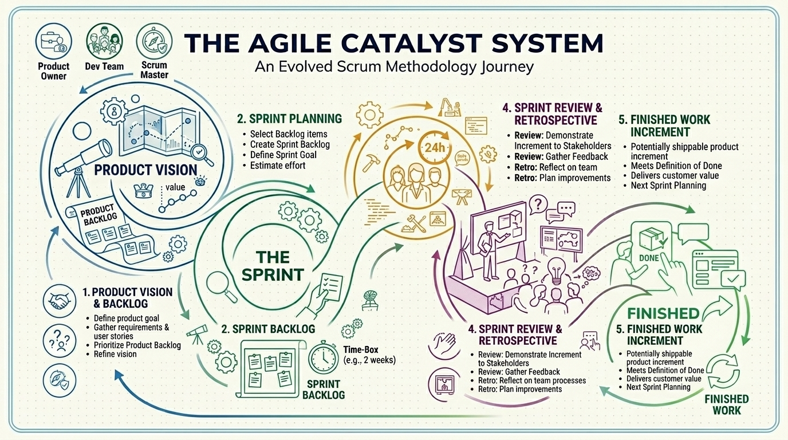
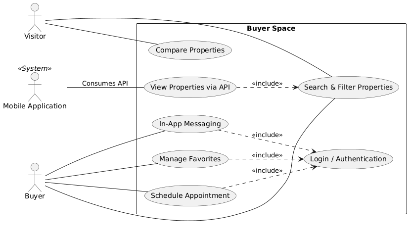
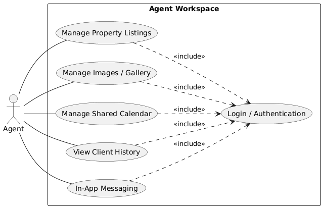
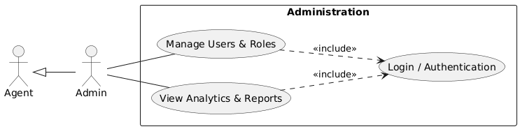
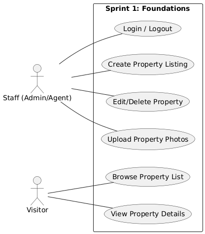
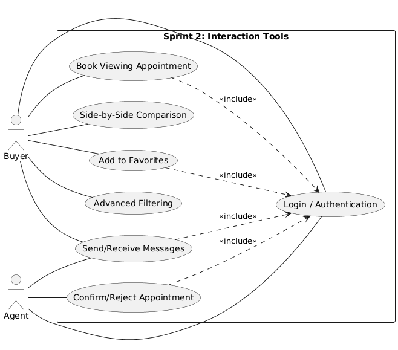
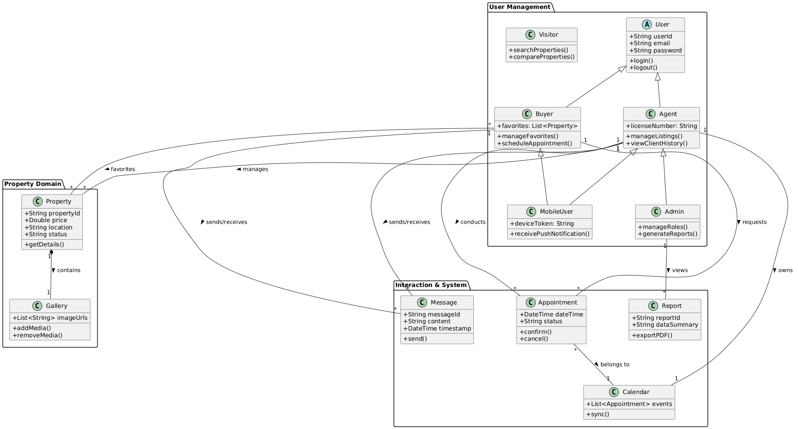

  
  

# Final Year Project
### PropertyHub - Integrated Real Estate Management System

**Created by:** AZIZ Soufiane  
**Supervised by:** M. ESSARRAJ Fouad  
**Program:** Web and Mobile Development

---

## Table of Contents

  

1

Project Context

  

2

Methodology

  

3

Functional Branch

  

4

Technical Branch

  

5

Design

  

6

Realization

  

7

Conclusion

---

## 1. Project Context

  

---

## 1.1. Define Problem

  <h3 style="margin-top:0;">Problem Definition</h3>
  

    The real estate sector faces challenges in efficiently connecting agencies, agents, and buyers, often resulting in fragmented communication, manual processes, and lack of real-time data. PropertyHub aims to solve these issues by providing an integrated, digital platform for seamless property management, transparent transactions, and enhanced user experience for all stakeholders.
  

---

## 2. Methodology: Design Thinking

  

---

## 2. Methodology: Scrum (Agile)

  

---

## 3. Functional Branch: Empathy

  

---

## Functional Branch: Use Cases

### Global Use Case - Client Part

  

---

### Global Use Case - Agent (Staff) Part

  

---

### Global Use Case - Admin Part

  

---

## Functional Branch: Use Cases

### Sprint 1: Foundations

  

---

### Sprint 2: Advanced Features

  

---

## 4. Technical Branch: Tech Stack

  
  

    <h4 style="text-align: center; border-bottom: 2px solid #029fcaff; padding-bottom: 8px;">Back-end & Architecture</h4>
    

        

            PHP 8.2+ • Laravel 12 • MySQL 8.0
        

    

    <ul style="list-style: none; padding: 15px 0 0 0; font-size: 0.9em; border-top: 1px solid #eee;">
      <li><strong>Architecture:</strong> MVC</li>
      <li><strong>Auth:</strong> Spatie Roles & Permissions</li>
      <li><strong>ORM:</strong> Eloquent</li>
    </ul>
  

  

    <h4 style="text-align: center; border-bottom: 2px solid #029fcaff; padding-bottom: 8px;">Front-end & Tools</h4> 
    

        

            Tailwind CSS • Alpine.js • Vite
        

    

    <ul style="list-style: none; padding: 15px 0 0 0; font-size: 0.9em; border-top: 1px solid #eee;">
      <li><strong>UI:</strong> Preline UI</li>
      <li><strong>Responsive:</strong> Mobile-First</li>
      <li><strong>Bundler:</strong> Vite</li>
    </ul>
  

---

## 5. Design: Class Diagram

  

---

## 6. Realization: Core Backend Implementation

  

    <h3 style="margin-top:0; font-size: 1.3em;">Public Service Layer</h3>
    <ul style="padding-left: 20px; margin-bottom: 0;">
      <li><strong>PropertyService:</strong> Browsing, search & favorites management</li>
      <li><strong>AppointmentService:</strong> Real-time booking & double-booking prevention</li>
      <li><strong>MessageService:</strong> In-app user-to-user messaging</li>
      <li><strong>GalleryService:</strong> Dynamic property image attachments</li>
    </ul>
  

  

    <h3 style="margin-top:0; font-size: 1.3em;">Admin & Staff Service Layer</h3>
    <ul style="padding-left: 20px; margin-bottom: 0;">
      <li><strong>AdminDashboardService:</strong> Key metrics & live analytics</li>
      <li><strong>AdminPropertyService:</strong> Full lifecycle property auditing</li>
      <li><strong>AdminUserService:</strong> Role & permission synchronization</li>
      <li><strong>AdminCalendarService:</strong> Interactive agent schedule mapping</li>
    </ul>
  

---

## 6. Realization: Database & Security

  

    <h3 style="color: #2e7d32; margin-top:0; font-size: 1.3em;">Robust Security & Auth</h3>
    <ul style="padding-left: 20px; margin-bottom: 0;">
      <li><strong>Spatie RBAC:</strong> Secure boundaries for Admin, Agent, and Buyer</li>
      <li><strong>Form Requests:</strong> Strict validation of inputs at controller gates</li>
      <li><strong>Password Hashing:</strong> Safe credential handling with bcrypt</li>
      <li><strong>Database Transactions:</strong> Safe multi-table writes preventing orphan records</li>
    </ul>
  

  

    <h3 style="color: #2e7d32; margin-top:0; font-size: 1.3em;">Advanced Business Logic</h3>
    <ul style="padding-left: 20px; margin-bottom: 0;">
      <li><strong>Atomic Booking:</strong> Checking agent schedules under transactional locks</li>
      <li><strong>Data Integrity:</strong> Foreign keys and cascade deletes protection</li>
      <li><strong>Paginated Queries:</strong> Optimized eager loading to solve N+1 query issue</li>
    </ul>
  

---

## 6. Realization: Quality Assurance & Testing

  <h3 style="color: #e65100; margin-top:0; font-size: 1.2em; margin-bottom: 8px;">Comprehensive Service Testing (Laravel Artisan Test Suite)</h3>
  

    An extensive, regression-proof test suite has been built to validate every aspect of the backend business logic.
  

  
  

    

      10 
      <strong style="font-size: 0.9em;">Test Suites</strong>
    

    

      110+ 
      <strong style="font-size: 0.9em;">Test Cases</strong>
    

    

      100% 
      <strong style="font-size: 0.9em;">Success Rate</strong>
    

  

  <ul style="padding-left: 20px; margin-top: 8px; margin-bottom: 0; font-size: 0.95em; line-height: 1.4;">
    <li>Coverage: Happy paths, validation gates, permission boundaries, and database locks.</li>
    <li>Command: <code>php artisan test --coverage</code></li>
  </ul>

---

## 7. Conclusion

### Thank you for your attention!
**Questions?**

---
footer: PropertyHub | Final Year Project | Solicode