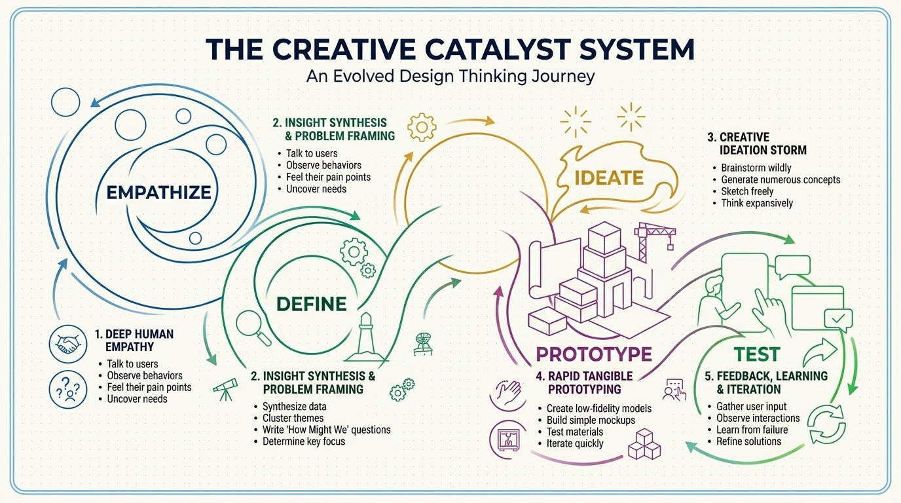
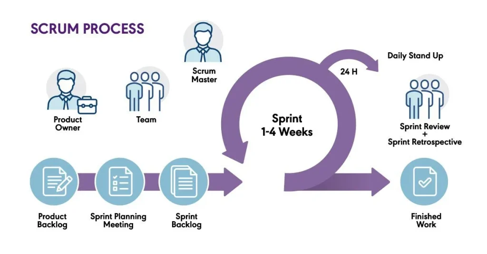
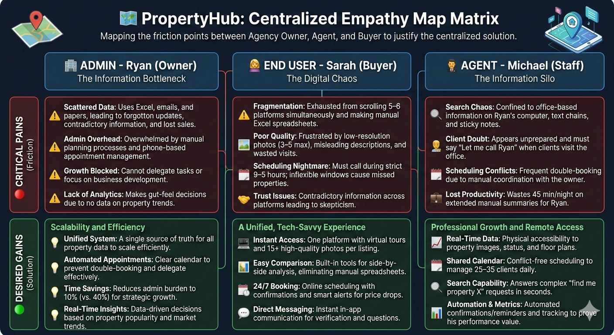
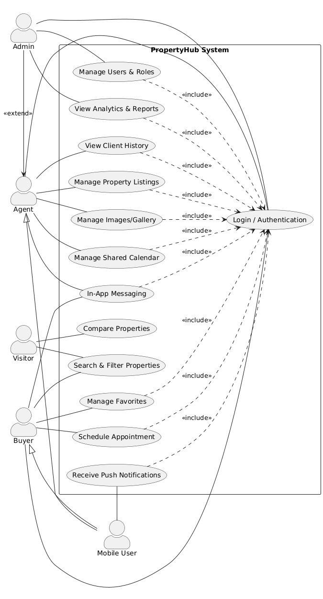

  
  

# Final Year Project
### PropertyHub - Integrated Real Estate Management System

**Created by :** AZIZ Soufiane  
**Supervised by :** M. ESSARRAJ Fouad  
**Program :** Web and Mobile Development

---

## Table of Contents

  

1

Project Context

  

2

Working Methodology

  

3

Functional Branch

  

4

Technical Branch

  

5

Design

  

6

Demonstration

  

7

Conclusion

---

## 1 - Project Context

> **Challenge:** Ryan, a real estate agency owner, manages properties through scattered spreadsheets and emails, resulting in lost sales, double-booking, and lost productivity.

  

---

## 2a - Design Thinking Methodology

The project applies **Design Thinking** across five stages:

  <strong>🔍 Empathy</strong> - Conducted interviews with 3 personas (property buyers, agency owners, real estate agents) to understand pain points and motivations.

  <strong>📋 Definition</strong> - Synthesized findings to identify core problems: data fragmentation, inefficient property search, poor client-agent communication.

  <strong>💡 Ideation</strong> - Brainstormed solutions resulting in an integrated platform with centralized property database, advanced search, and messaging system.

---

## 2b - Agile/Scrum Methodology

**PropertyHub** development follows **Scrum framework** with 2-week sprints:

  

---

## 3a - User Research: Personas & Empathy

### Ryan - Digital Opportunity

> Agency owner seeking streamlined operations and better client engagement

  <strong>😟 What Ryan feels:</strong> Overwhelmed by manual processes, scattered client information, and difficulty scaling the business.

  <strong>💡 Opportunity:</strong> Centralized platform to manage all properties, clients, and agents with built-in messaging and analytics.

---

## 3b - Empathy Map Analysis

  

---

## 4a - Problems Identified

> **3 Core User Groups, 15+ Pain Points Resolved**

  <strong>🧑‍💼 Ryan (Agency Owner):</strong> Scattered client data, manual reporting, scaling challenges

  <strong>👩‍💼 Sarah (Property Buyer):</strong> Multiple platform searches, slow agent response, incomplete property info

  <strong>👨‍💻 Michael (Real Estate Agent):</strong> Inefficient lead management, outdated tools, limited client insights

---

## 4b - Solutions Designed

  <strong>✅ Centralized Property Database</strong> - All listings in one system with real-time updates

  <strong>✅ Advanced Search & Filters</strong> - Quick property discovery by location, price, amenities

  <strong>✅ Integrated Messaging System</strong> - Direct communication between buyers, agents, and staff

  <strong>✅ Role-Based Dashboard</strong> - Customized views for owners, agents, and buyers

---

## 5a - Use Cases: Global Overview

  

---

## 5b - Use Cases: Sprint 1 (Foundations)

  

---

## 5c - Use Cases: Sprint 2 (Advanced Features)

  

---

## 6a - Application Design: Wireframes

  

---

## 6b - Data Model (Entity-Relationship Diagram)

  

---

## Technical Stack

  <strong>💾 Backend & Database</strong> 
  

    Laravel 12
    PHP 8.2+
    MySQL 8.0
    REST API
  

  <strong>🎨 Frontend & UI</strong> 
  

    Tailwind CSS
    Blade Templates
    Alpine.js
    AJAX
  

  <strong>🛠 Tools & DevOps</strong> 
  

    Vite (Build Tool)
    Git/GitHub
    VS Code
    PHPUnit Testing
  

---

## Key Features Summary

  ✅ **User Management** - Create accounts with roles (buyer, agent, owner)  
  ✅ **Property Management** - Add, edit, delete properties with full descriptions  
  ✅ **Advanced Search** - Filter by location, price, amenities, and property type  
  ✅ **Direct Messaging** - Real-time communication between platform users  
  ✅ **Property Favorites** - Save and organize favorite listings  
  ✅ **Admin Analytics** - Dashboard with insights on listings, users, and activity  
  ✅ **Responsive Design** - Works seamlessly on desktop, tablet, and mobile

---

## Conclusion

**PropertyHub** addresses critical pain points in the real estate industry by creating a **unified, user-centric platform** that empowers all stakeholders:

- 🎯 **For Ryan:** Operational efficiency and business scalability
- 👩 **For Sarah:** Faster property discovery and better communication
- 👨 **For Michael:** Modern tools for effective client management

**Technical Excellence:** Built with modern frameworks and best practices ensures maintainability, scalability, and security.

**Impact:** A comprehensive solution that transforms how real estate professionals and buyers interact with property information.

---
footer: PropertyHub | Final Year Project | OFPPT Sidi Slimane

